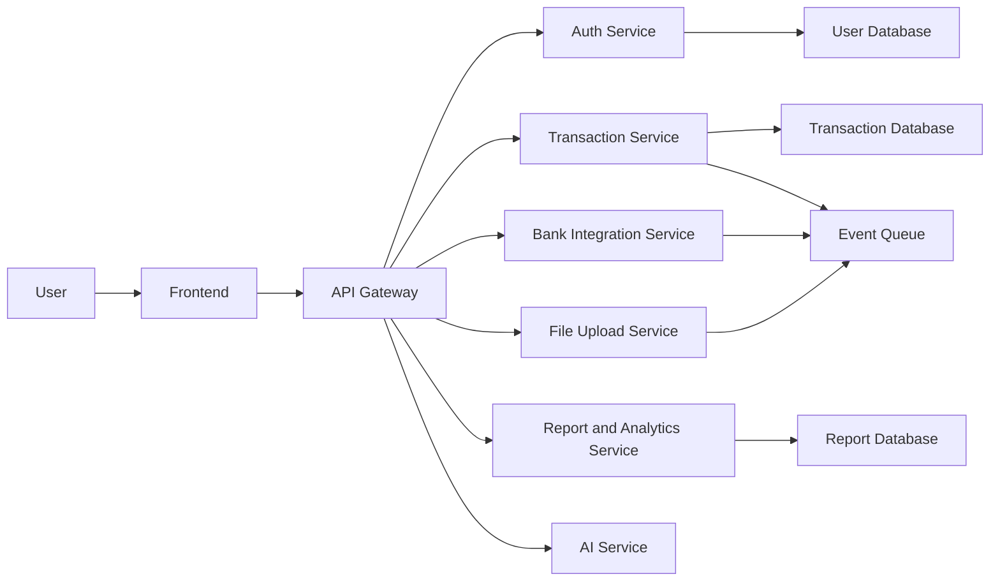
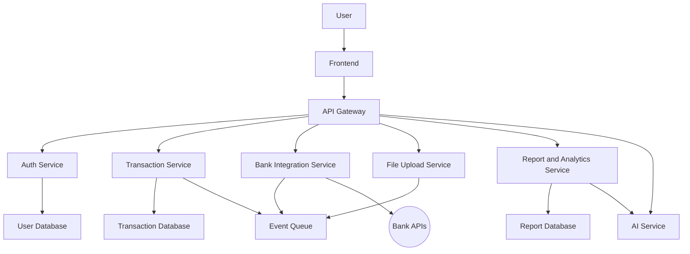
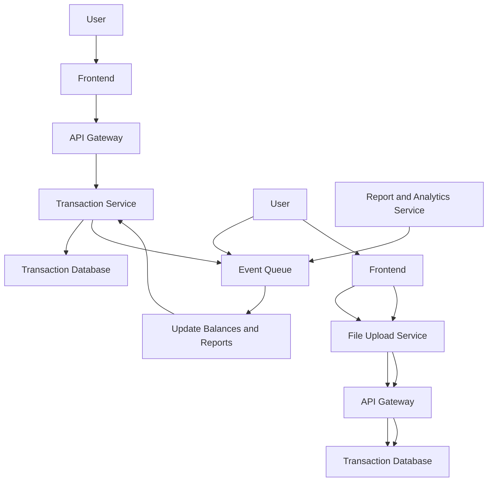

# PocketGuardian

## Resumen del Proyecto

### Nombre de la Aplicación:
**PocketGuardian**

### Requerimientos Clave:
1. **Gestión de Transacciones**: 
    - Ingresos, gastos, tarjetas de crédito, créditos bancarios, inversiones, transacciones recurrentes. 
    - Administración flexible por parte del usuario con actualización de saldos.
2. **Integración Bancaria**: 
    - Arquitectura preparada para integraciones sencillas a través de eventos y APIs.
3. **Cargas de Archivos**: 
    - Inicialmente soportar cargas manuales de archivos con formatos establecidos.
    - Sistema preparado para futuras integraciones de IA.
4. **Reportes y Análisis**: 
    - Amplia gama de reportes, presupuestos y análisis de datos detallados.
5. **Seguridad y Autenticación**: 
    - Implementación de OAuth.
6. **Multi-plataforma**: 
    - Uso de MAUI para interfaces web y móviles, backend en .NET y Python para tareas específicas, arquitectura basada en microservicios.

### Atributos de Calidad:
1. **Seguridad**: 
    - Priorización alta, con OAuth y estrategias de protección de datos.
2. **Rendimiento**: 
    - Diseño para ser rápido y eficiente aún con un bajo número inicial de usuarios (<100) pero con capacidad de escalar.

### Posibles Riesgos:
1. **Cumplimiento Legal**: 
    - Regulaciones financieras y de privacidad.
2. **Integración con Sistemas Bancarios**: 
    - Estabilidad y disponibilidad de APIs externas.
3. **Manejo de Datos Sensibles**: 
    - Estrategias para asegurar la privacidad y protección de datos.

## Diagramas

### Diagrama de Componentes

### Diagrama de Arquitectura

### Diagrama de Proceso

