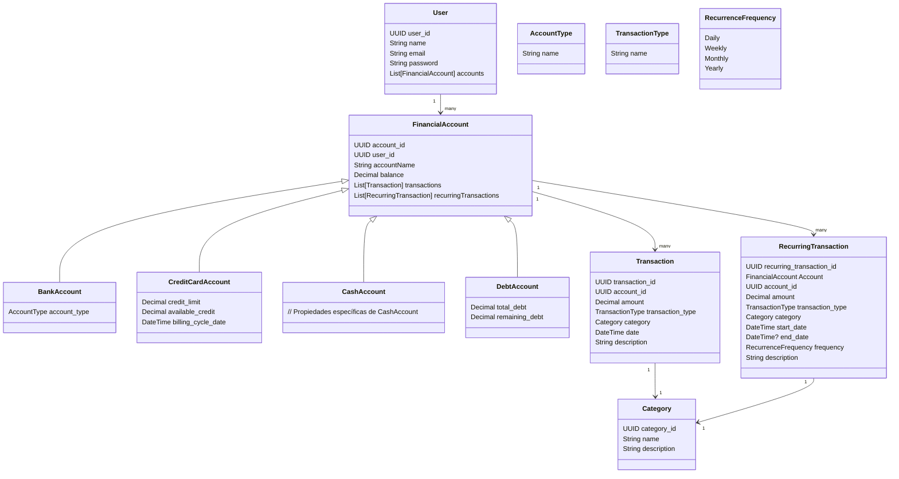

```mermaid
classDiagram
   User "1" --> "many" FinancialAccount
   FinancialAccount <|-- BankAccount
   FinancialAccount <|-- CreditCardAccount
   FinancialAccount <|-- CashAccount
   FinancialAccount <|-- DebtAccount
   FinancialAccount "1" --> "many" Transaction
   FinancialAccount "1" --> "many" RecurringTransaction
   Transaction "1" --> "1" Category
   RecurringTransaction "1" --> "1" Category

   class User {
       UUID user_id
       String name
       String email
       String password
       List[FinancialAccount] accounts
   }

   class FinancialAccount {
       UUID account_id
       UUID user_id
       String accountName
       Decimal balance
       List[Transaction] transactions
       List[RecurringTransaction] recurringTransactions
   }

   class BankAccount {
       AccountType account_type
   }

   class CreditCardAccount {
       Decimal credit_limit
       Decimal available_credit
       DateTime billing_cycle_date
   }

   class CashAccount {
       // Propiedades específicas de CashAccount
   }

   class DebtAccount {
       Decimal total_debt
       Decimal remaining_debt
   }

   class Transaction {
       UUID transaction_id
       UUID account_id
       Decimal amount
       TransactionType transaction_type
       Category category
       DateTime date
       String description
   }

   class RecurringTransaction {
       UUID recurring_transaction_id
       FinancialAccount Account
       UUID account_id
       Decimal amount
       TransactionType transaction_type
       Category category
       DateTime start_date
       DateTime? end_date
       RecurrenceFrequency frequency
       String description
   }

   class Category {
       UUID category_id
       String name
       String description
   }

   class AccountType {
       String name
   }

   class TransactionType {
       String name
   }

   class RecurrenceFrequency {
       Daily
       Weekly
       Monthly
       Yearly
   }
```